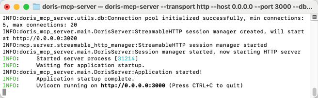
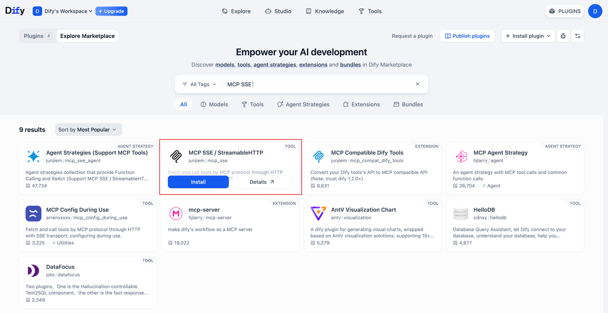
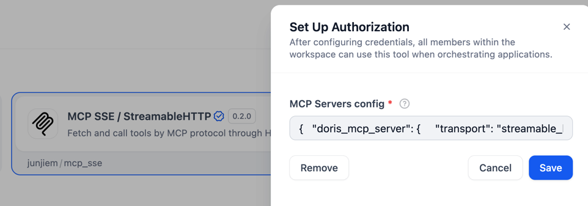
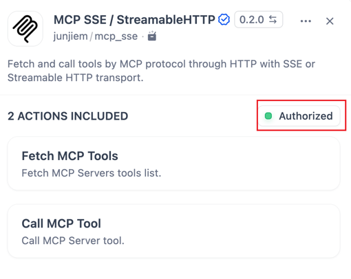
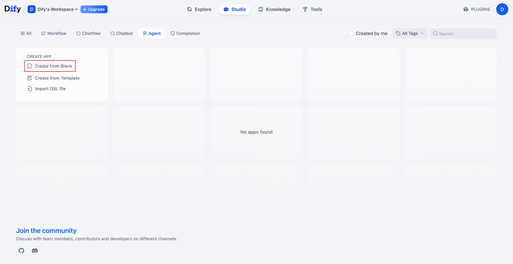
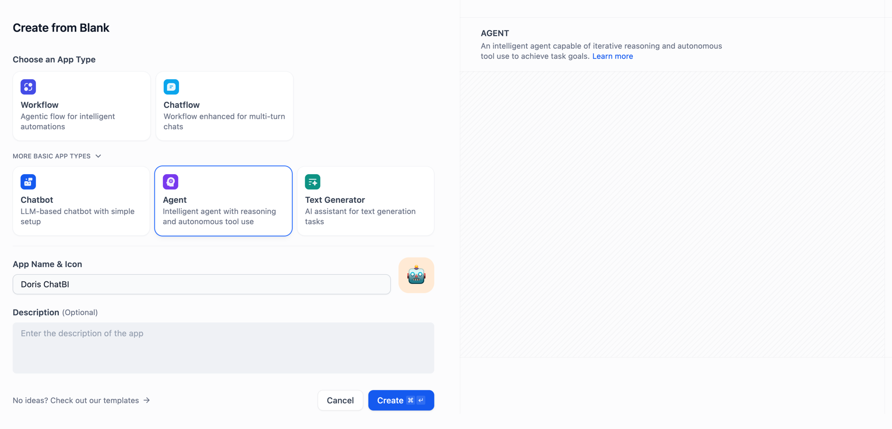
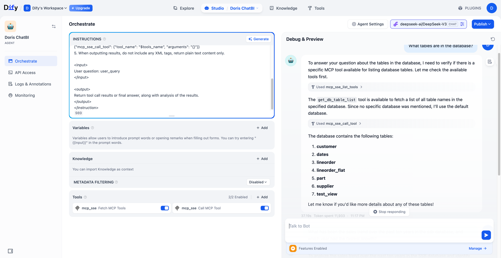
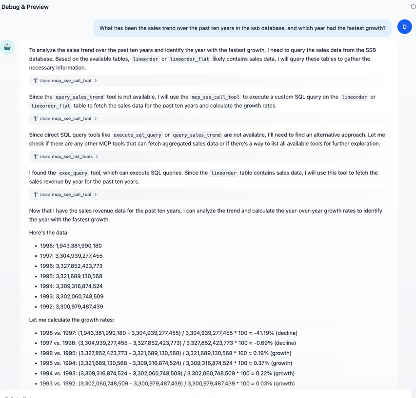

<!--
Licensed to the Apache Software Foundation (ASF) under one
or more contributor license agreements.  See the NOTICE file
distributed with this work for additional information
regarding copyright ownership.  The ASF licenses this file
to you under the Apache License, Version 2.0 (the
"License"); you may not use this file except in compliance
with the License.  You may obtain a copy of the License at

  http://www.apache.org/licenses/LICENSE-2.0

Unless required by applicable law or agreed to in writing,
software distributed under the License is distributed on an
"AS IS" BASIS, WITHOUT WARRANTIES OR CONDITIONS OF ANY
KIND, either express or implied.  See the License for the
specific language governing permissions and limitations
under the License.
-->


# Dify Example: Integrating Doris MCP Server

This document demonstrates how to integrate and use `doris-mcp-server` in Dify to perform Doris SQL calls via MCP.

## Table of Contents

- [Prerequisites](#prerequisites)  
- [Starting the MCP Server](#starting-the-mcp-server)  
- [Ngrok Tunnel (Optional)](#ngrok-tunnel-optional)  
- [Installing & Configuring the Plugin in Dify](#installing--configuring-the-plugin-in-dify)  
- [Creating a Dify App](#creating-a-dify-app)  
- [Adding MCP Tools](#adding-mcp-tools)  
- [Example Calls](#example-calls)


-----

### Prerequisites

First, install `mcp-doris-server`:

```bash
pip install mcp-doris-server
```

## Starting the MCP Server

Run the startup script:

```bash
# Full configuration with database connection
doris-mcp-server \
    --transport http \
    --host 0.0.0.0 \
    --port 3000 \
    --db-host 127.0.0.1 \
    --db-port 9030 \
    --db-user root \
    --db-password your_password
```

If successful, you'll see logs similar to this:



-----

## Ngrok Tunnel (Optional)

If your Dify deployment requires a publicly accessible endpoint, you can use the **ngrok** tool. Ngrok is a third-party service that securely exposes local servers to the internet.


-----

## Installing & Configuring the Plugin in Dify

1.  In the Dify console, go to **Plugin Marketplace**, search for, and install **MCP‑SSE / StreamableHTTP**:
 

2.  After installation, click **Configure** and set the URL to your public or local address. For example, if you're using `ngrok`, this should be the public URL `ngrok` provides, in the format `https://<your-domain>/mcp`. If Dify can directly access your local server, use `http://localhost:3000/mcp`.

    ```json
    {
      "doris_mcp_server": {
        "transport": "streamable_http",
        "url": "https://<your-domain>/mcp"
      }
    }
    ```
     

3.  Click **Save**. If configured correctly, you'll see a green **Authorized** indicator:

   

-----

## Creating a Dify App

1.  In the Dify console, click **New App** → **Blank App**.


2.  Select **Agent** as the template and set the **App Name** (e.g., `Doris ChatBI`).



3.  Import from DSL,[dify_doris_dsl.yml](dify_doris_dsl.yml)

-----

## Instructions & Tool Configuration

### Instruction Block

Paste the following into the **Instruction** field:

```
<instruction>
Use MCP tools to complete tasks as much as possible. Carefully read the annotations, method names, and parameter descriptions of each tool. Please follow these steps:
1. Analyze the user's question and match the most appropriate tool.
2. Use tool names and parameters exactly as defined; do not invent new ones.
3. Pass parameters in the required JSON format.
4. When calling tools, use:
   {"mcp_sse_call_tool": {"tool_name": "<tool_name>", "arguments": "{}"}}
5. Output plain text only—no XML tags.
<input>
User question: user_query
</input>
<output>
Return tool results or a final answer, including analysis.
</output>
</instruction>
```

### Adding MCP Tools

In the **Tools** pane, click **Add** twice to add two entries, both named `mcp_sse` (they will inherit the transport and URL from the plugin):


-----

## Example Calls

### List Tables in Database

  * **User**: What tables are in the database?

  * **Result**: Dify will call the MCP tool to run `SHOW TABLES` and return the list.
  

### Sales Trend Over Ten Years

  * **User**: What has been the sales trend over the past ten years in the ssb database, and which year had the fastest growth?

  * **Result**: The tool will execute the SQL, calculate growth rates, and return data.
  
